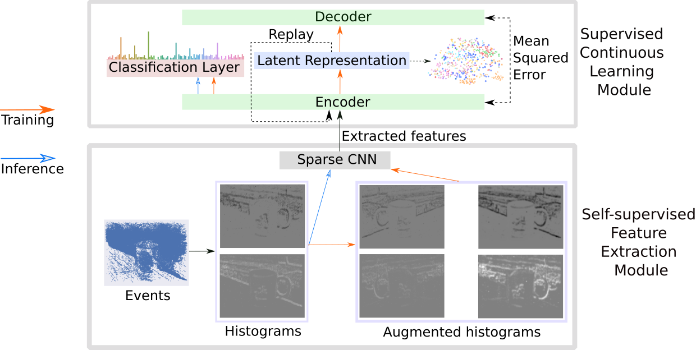

## Lifelong Learning from Event-based Data
### The lifelong learning module.
2021 Vadym Gryshchuk (vadym.gryshchuk@protonmail.com)

[Master Thesis](https://www.inf.uni-hamburg.de/en/inst/ab/wtm/research/software.html) | [ESANN 2021](https://www.esann.org/sites/default/files/proceedings/2021/ES2021-146.pdf)

See the License

We study lifelong learning from data generated by event cameras. Contemporary methods for incremental learning are predominantly based on the frame-based data recorded by conventional shutter cameras. An event camera delivers high dynamic range, low power consumption, and high temporal resolution, thus making it suitable for dynamic environments, in which knowledge must be accumulated incrementally. We propose an architecture for lifelong learning that is composed of two modules: a feature extractor and an incremental learner. The feature extractor is utilized as a self-supervised sparse convolutional neural network, which processes event-based data. The incremental learner uses a habituation-based method that works in tandem with other existing techniques to mitigate catastrophic forgetting. The conducted experiments show that our proposed method is capable of effective incremental learning without forgetting previously learned experiences.

The following figure illustrates the architecture:

This is the implementation for the upper module of the architecture for Lifelong Learning. 

### Installation 

1. `conda env create --file env.yml`

### Data Collection
(The extracted features of `NCALTECH101` for testing purposes are already provided.)

1. See the code for the feature extraction module: https://github.com/VadymV/events_feature_extractor
2. Place the extracted features into the `store` folder. The following tree should be created: `store` -> `datasets` -> [`ncaltech12`, `ncaltech256`, `nmnist`, `ncaltech101`] -> [`training`, `testing`]

### Execution 

1. Adjust settings in `settings_paper.yaml`.
2. Run `python run_ncaltech_paper.py --settings_file settings_paper.yaml`

---
**The provided code uses the code from https://github.com/GMvandeVen/brain-inspired-replay. See the header of each file for more information.**

---
# torch 1.10.1
